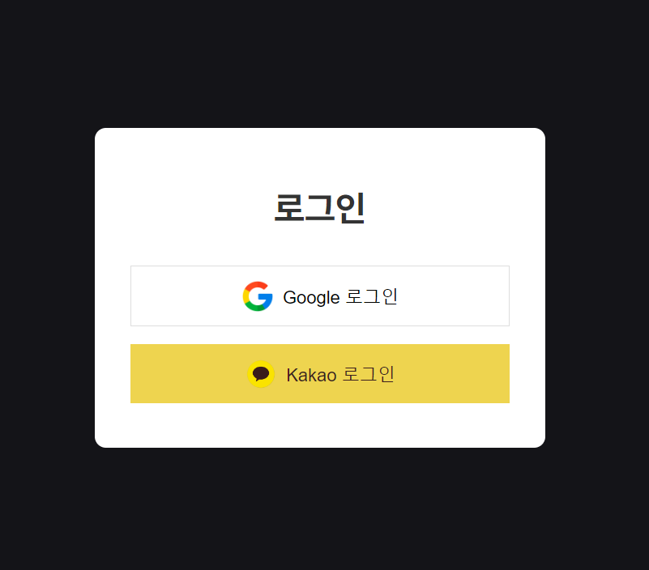

## [MoneyMinder 웹 사이트](http://moneyminder.co.kr)

## 기술 스택
### 백엔드
* Spring Boot 3.3.0, Java 17
* JPA & QueryDsl
* Spring Security
* H2 (로컬, 테스트)
* Mysql (개발 서버)
* Embedded-Redis (로컬, 테스트)
* Redis (개발 서버)
* OAuth2 & JWT
* Actuator, Prometheus, Loki (모니터링)
* Spring Event

### 프론트
* Vue.js 3
* Vue Router
* Vuex
* Axios
* Chart.js
* jwt-decode

### 인프라
* AWS EC2
* Elastic Cache
* AWS S3 , S3 Bucket
* AWS RDS
* AWS Certificate Manager
* Route53
* Cloud Front
* Docker, Docker-compose
* Github Actions
* Nginx
* Let`s Encrypt

- - -
## 서버 아키텍처 및 배포

### 서버 아키텍처
  

  

### 배포 과정

- - -
## 기능
1. OAuth2 로그인

 

2. 대시보드 페이지

 

3. 거래내역 페이지

 

4. 예산 페이지

